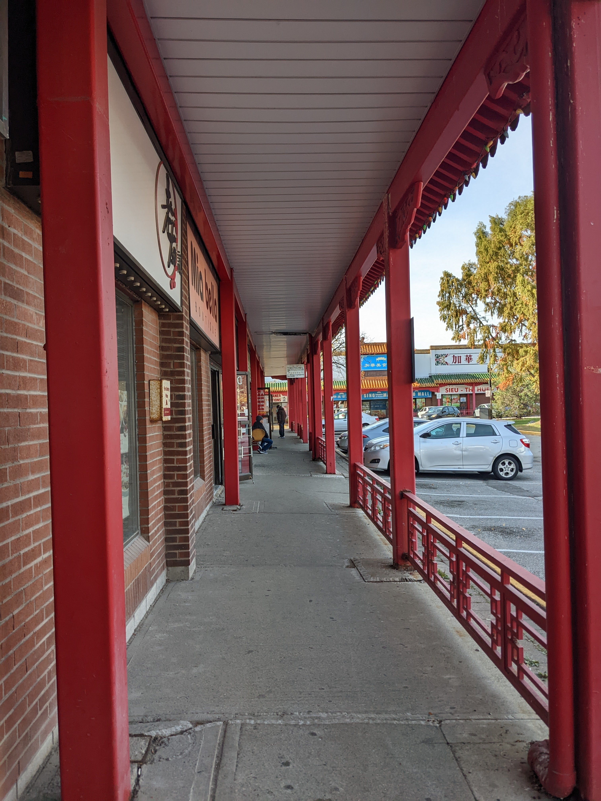
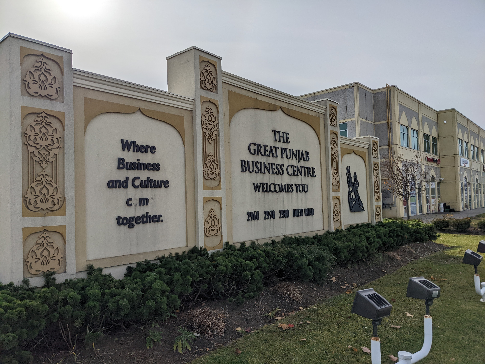
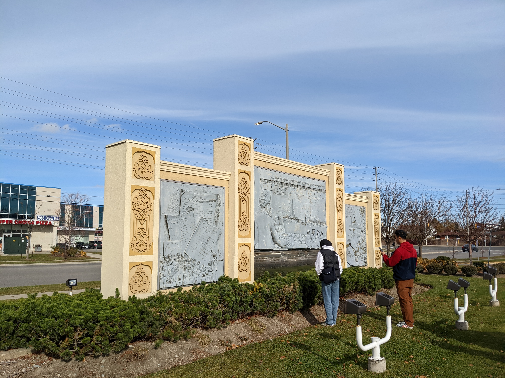
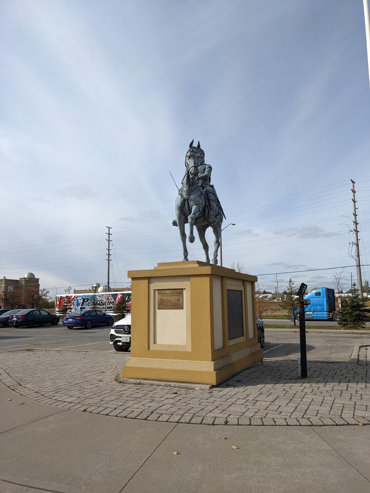
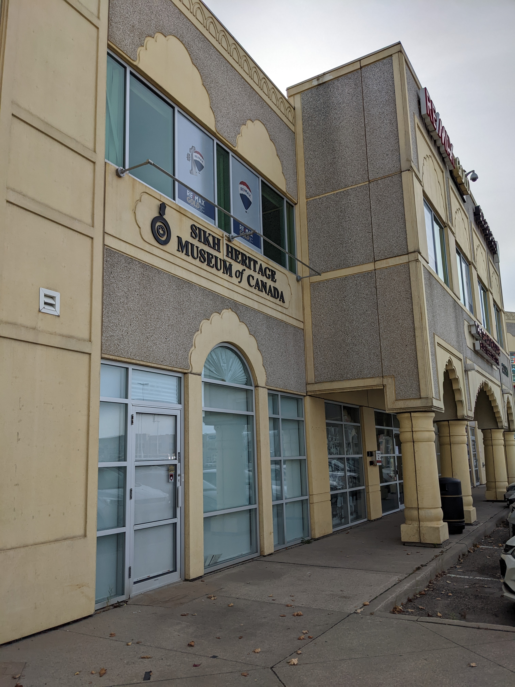
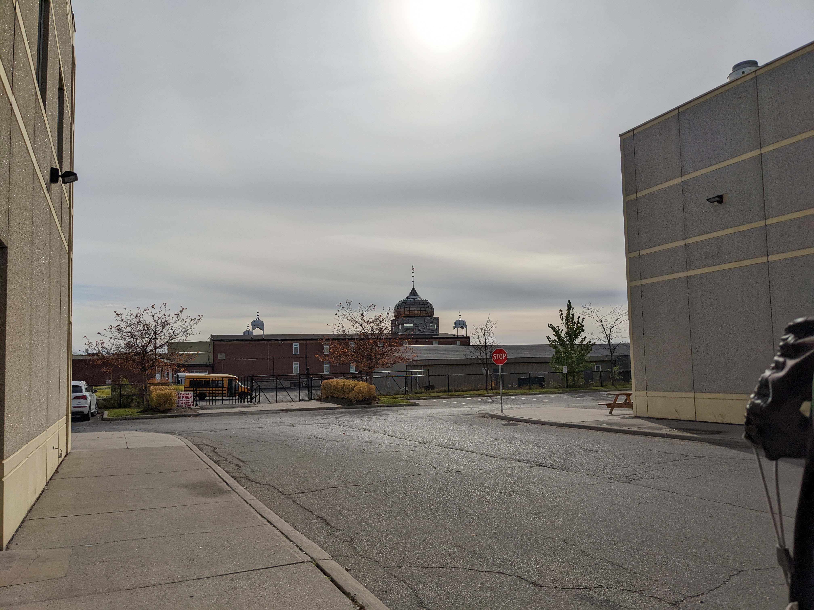

## Bus Tour Reflection
A project identifying diversity and inclusivity during a bus tour of the Mississauga Chinese Centre and The Great Punjab Business Centre, located in Mississauga, Ontario, Canada.

**Land Acknowledgment**

The author wishes to acknowledge lands which constitute the present-day City of Mississauga as being part of the Treaty and Traditional Territory of the Mississauga’s of the Credit First Nation, The Haudenosaunee Confederacy the Huron-Wendat and Wyandot Nations (Mississauga, 2021).

**Site Map**

      

*Interactive Map of both sites with census tracts*

**Background Demographics**

The City of Mississauga has a highly diverse population of Chinese and Punjab residents. In fact, 7.8% of the total population denotes their ethnic or cultural origin as Chinese, while 1.5% denotes their origin as Punjabi. At the local level, the census tract for the Mississauga Chinese Centre denotes 3.7% of the population as Chinese ethnic origin. For The Great Punjab Business Centre, 4.3% of the population denotes their ethnic or cultural origin as Punjabi (Government of Canada, 2022a, 2022b, 2022c). These numbers showcase the different ethnic origins as being important to the cultural make up of the city.

**Site Description**

The Mississauga Chinese Centre stands out as a landmark along Dundas Street. Its entryway gives the impression of a specifically Asian centre. The entry into the centre displayed the types of uses, including mostly retail spaces. The arch also serves as a break into the existing landscape along Dundas Street, which is populated by other retail spaces and a residential neighbourhood. The large residential slab across the street reflects this break, which ironically, the centre’s towers meant to imitate a view over the city, gets overshadowed by this slab. In contrast, the mostly empty lands adjacent to the slab shows potential for further development around the site. In addition, the train tracks, which carry Go Transit’s Milton Line, delineate the site and the neighbourhood’s activities to Dundas Street.
In contrast, The Great Punjab Business Centre blends with its surroundings along the Airport Road industrial corridor. The entryway, located on Drew, offers a familiar built form to any commercial and retail spaces. It is only once visitors enter the site that the intricate details of the buildings become more prominent. The colour and choice of material exemplifies the centre as a retail and commercial space for the Punjab community.

**Key Features of the Site**

According to the numerous inscriptions along the site, the centre was built to imitate a Chinese commercial centre and city, with its large corner towers, the arch, the nine dragon wall, Soo Chow garden, the fortress, the stele, and the covered walkways. Indeed, these walkways are meant to “imitate the ones in Beijing”, which offers protection and serves as a marker for the retail spaces along the site. Culturally, the nine dragon wall, defined as the only one outside of Asia, reinforce the space’s clear Chinese influence and offers a strong welcoming marker for customers entering the space. In fact, one may not call them customers, but merely citizens of the space, as the site offers a home away from home, even if they have always lived in Canada. The large tower of the fortress serves as a second marker for those who enter the space by its second entrance, further implying the space’s purpose as a Chinese centre.
The Great Punjab Business Centre offers a few landmarks to denote the space for its community. First, the mural wall with the engraved history denotes the site’s focus on the Punjab community. As written, the depiction of the Komagata Maru gives way for reflection as to how these immigrants arrived in Canada. Next, the statue of Maharaja Ranjit Singh depicts the founder of the Sikh Empire overlooking and acting as overlooker on the site. The Sikh Heritage Museum of Canada located amongst the retail spaces and offices, further entrenches the cultural usage of the site. As such, businesses and offices offer diverse services to the community, including integration services offering immigrants an opportunity for life in Canada.

**Inclusive Spaces**

Inclusivity, which aims to remove barriers for all, defines the overall character of the space (Ricee, 2017). The retail spaces offer services to all customers. The plaques located around the centre that define its built form also includes English for those who wish to better understand the space’s character.
The Punjab business centre’s many job centre offering establishes an inclusive environment to integrate the community’s needs with the surrounding reality of Canadian life. Located amongst industrial spaces around the airport, and close to the strong Sikh population in Brampton, confirms the choice of this location as close to its community.

**Knowledge and Sharing**

To learn and share knowledge about another culture is important for planners. As we aim to build inclusive communities, knowledge serves as a guide to better understand the goal and purpose of these spaces. As such, the centre’s use of descriptive imagery in the fortress’ hallway helps outsiders to appreciate the built form and purpose of the centre as central to the Chinese community. The mix of guidance and retail offers a theoretical and practice use of the space, where one may wish to immerse themselves and discover a foreign cultural community. In similar fashion, the landmarks around the Punjab business centre reinforce the notion of the space as welcoming to the Sikh and non-Sikh community. The inclusion of the museum further demonstrates the space as knowledge sharing within the larger communities in the Greater Toronto Area.

**How to approach a space as a planner and gain knowledge**

A strong background about the space before visiting would be encouraged to better prepare ourselves. This can be achieved through simply researching about the existing community and its historical immigration to the country. In addition to the offerings of knowledge each space may have, planners should be concerned with the history of the space, such as the choice of location, existing surroundings, and how it was planned to interact with established communities.
Planners should learn about the history of the site, including why this space was chosen to locate the Chinese centre. As such, a careful study of zoning by-laws and demographics of the city can aid in offering a better understanding of the site. Information may also be contained in research conducted about the community. Epistemological studies about the community offers a dialogue between researchers and the people of the community. Future goals and purposes by the city can inform possible changes and impacts to the space, for example the Dundas Connects which can aim to offer an alternative to the automobile for travelling to the site.

## Mississauga Chinese Centre
*Arch at entryway*

*Covered walkway*

*Nine Dragon Wall*

*Pavilion*

## The Great Punjab Business Centre
*Mural at entrance*

*Mural with depiction of the Komagata Maru*

*Statue of Maharaja Ranjit Singh*

*Sikh Heritage Museum of Canada*

*Nearby Gurdwara*

**References**

Government of Canada, S. C. (2022a, February 9). Profile table, Census Profile, 2021 Census of Population—5350510.00 &#91;Census tract&#93;, Ontario. https://www12.statcan.gc.ca/census-recensement/2021/dp-pd/prof/index.cfm?Lang=E

Government of Canada, S. C. (2022b, February 9). Profile table, Census Profile, 2021 Census of Population—5350528.62 &#91;Census tract&#93;, Ontario. https://www12.statcan.gc.ca/census-recensement/2021/dp-pd/prof/index.cfm?Lang=E

Government of Canada, S. C. (2022c, February 9). Profile table, Census Profile, 2021 Census of Population—Mississauga, City (CY) &#91;Census subdivision&#93;, Ontario. https://www12.statcan.gc.ca/census-recensement/2021/dp-pd/prof/index.cfm?Lang=E

Mississauga, C. of. (2021, November 11). Mississauga Further Strengthens Its Commitment to Indigenous Communities (Mississauga, Ontario, Canada). City of Mississauga; City of Mississauga. https://www.mississauga.ca/city-of-mississauga-news/news/mississauga-further-strengthens-its-commitment-to-indigenous-communities/

Ricee, S. (2017, February 28). What is Inclusivity? &#91;2022&#93; | Diversity for Social ImpactTM. https://diversity.social/inclusivity/
