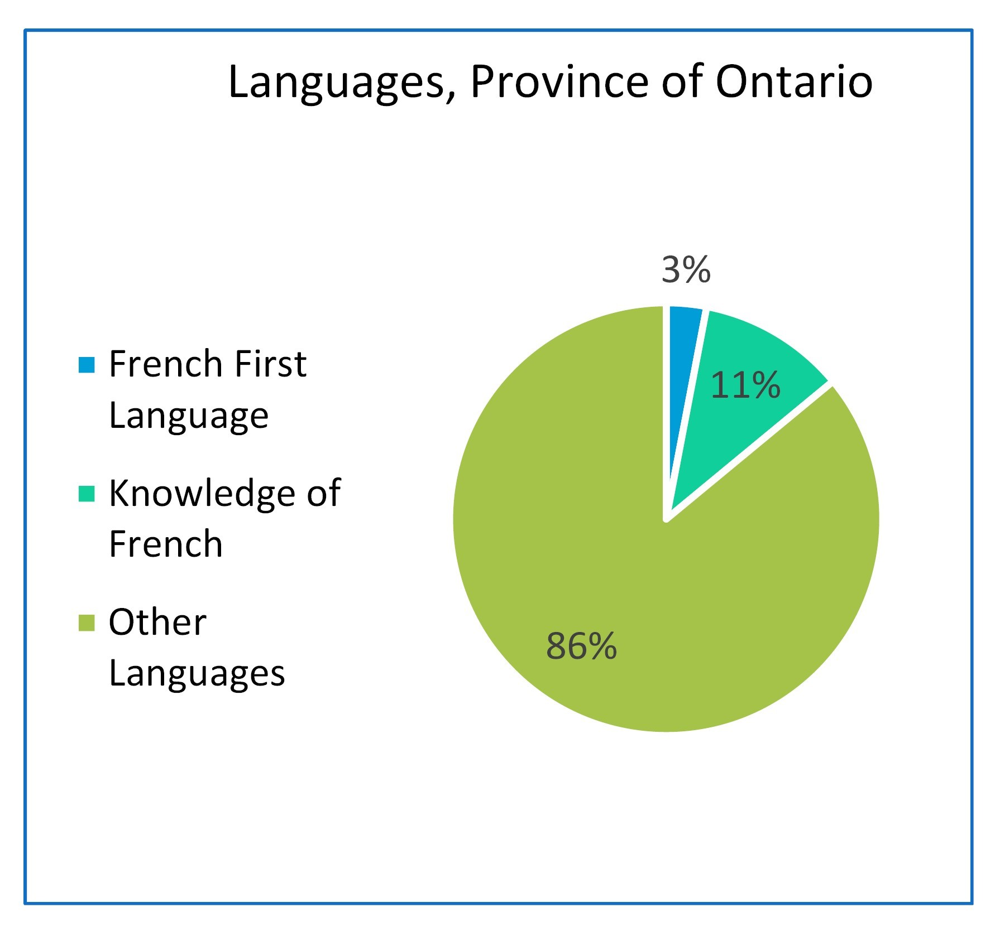
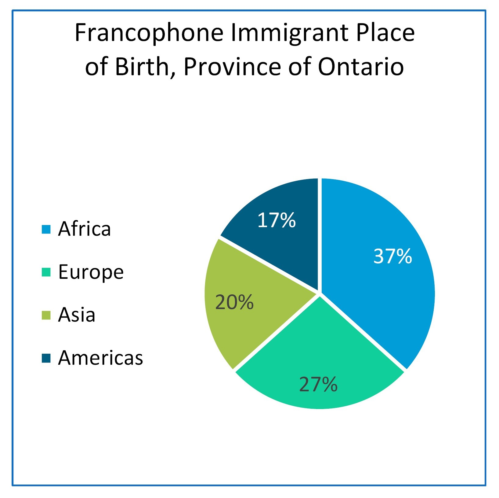
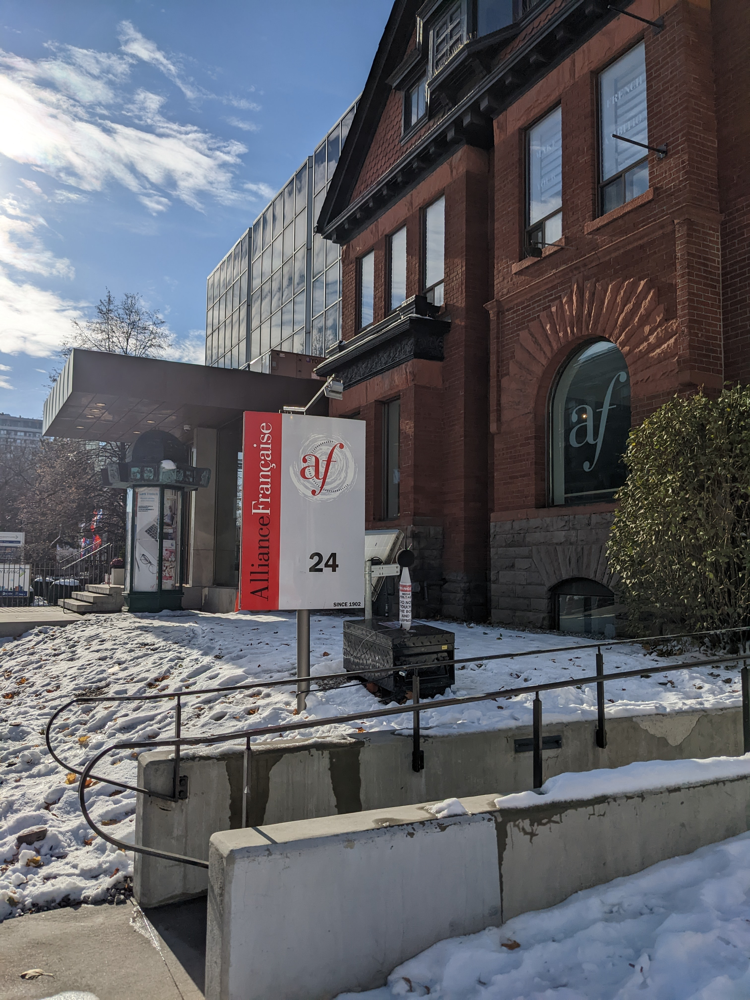

# Jane's Walk Tour Proposal
A project outlining diversity and inclusivity through a Jane's Walk tour proposal. [Learn more about Jane's Walk](https://janeswalk.org/about/). This project was inspired by a Doors Open tours provided by [La Société d'Histoire de Toronto](https://sht.ca/). 

**Land Acknowledgment**

The author wishes to &#34;acknowledge that the present-day City of Toronto is located on the traditional territory of many nations including the Mississaugas of the Credit, the Anishnabeg, the Chippewa, the Haudenosaunee and the Wendat peoples and is now home to many diverse First Nations, Inuit and Métis peoples. The author also acknowledges that the City of Toronto is covered by Treaty 13 signed with the Mississaugas of the Credit, and the Williams Treaties signed with multiple Mississaugas and Chippewa bands&#34; (Toronto, 2018).

## Background

It was four centuries ago that the French settled in what is now called Ontario (Sylvestre, 2020). Their presence has not always been welcomed, as demonstrated by the fights they had to keep their language and culture. First, the Regulation 17 from 1912 to 1917 prohibited French from being taught in schools. The Montfort event from 1997 to 2002 reflects their resilience, as the fought the closure of a French language hospital in Ontario (Arseneault & Bock, 2004; Sylvestre, 2020). More recently the 2018 protest against the provincial government’s budget cuts which affected francophones, namely by eliminated funding for the francophone university in the Greater Toronto Area (Crawley, 2018; Marquis, 2018). Throughout these battles, the cultural and ethnic makeup of Franco-Ontarians has changed to become more inclusive of other French speaking countries.

As of the 2021 Canadian census, 3.4% (484 425) of Ontario denote French as first language spoken at home with 11.1% (1 550 545) having a knowledge of French. In Toronto, 1.4% (38 695) denote French as first language spoken at home with 8.6% (238 505) having knowledge of French (Government of Canada, 2022).

*Knowledge of French in Ontario and Toronto (Government of Canada, 2022)*

According to the data based on the 2016 Canadian census, for the francophones in Ontario, 17% are born abroad where 37% immigrated from Africa, 27% from Europe, 20% from Asia and 17% from the Americas (Toolkit, 2016). At the Toronto level, 48% are born abroad where 28% immigrated from Africa, 32% from Europe, 27% from Asia and 14% from the Americas (Social Development, Finance & Administration, Toronto, 2020).

*Francophone Population in Ontario and Toronto (Toolkit, 2016; Social Development, Finance & Administration, Toronto, 2020)*

 *Place of Birth of Francophones in Ontario and Toronto (Toolkit, 2016; Social Development, Finance & Administration, Toronto, 2020)*

When building inclusive cities, we must consider the historical cultural heritage of communities. By listening to these communities, policies can be written in a way that considers the variety of knowledge. The communities must fit into the existing city make up.

Having grown up in the francophone community, it is important to realize the current diversity of francophones in Ontario, and certainly Toronto as a multicultural city. As such, this tour will guide us through important landmarks and institutions that reflect the history of Franco-Ontarians.

Therefore, three important questions are at hand

***Were New France’s activities with indigenous people seen as early colonisation or simply as commerce?***

***Is the Franco-Ontario population properly included as part of a historical context in the City of Toronto?***

***How does the UOF contribute to building a more inclusive society?***

## Map with Sites

      

*Interactive Map of Sites with Route*

**Transit Directions**

The transit walk uses TTC buses and subway. It starts at **Fort Rouillé** (next to Scadding Cabin on CNE grounds).
1. A short walk to take the 29 Dufferin bus northbound (14470 Saskatchewan Rd at Dufferin St) to Dufferin Station.
2. Then, a Westbound Line 2 Train to Old Mill Station.
3. A short walk to **Étienne Brûlé Park** (10 Catherine St).
4. A walk back to Old Mill Station to take an Eastbound Line 2 Train to Spadina Station.
5. A short walk along Spadina Avenue to **Alliance Française Toronto Campus** (24 Spadina Rd).
6. Walk back to Spadina, to take a Southbound Line 1 Train to Union Station.
7. Exit Union Station at Bay Street and take Southbound 19 Bay bus (246 Bay St at Front St) to Lower Jarvis St (15320 Queens Quay at Lower Jarvis St).
8. Walk to **Université de l’Ontario français** (9 Lower Jarvis St).

## Fort Rouillé

Trading post between the French and indigenous people existed along the shores of Lake Ontario, the first in 1720 along the Humber River, the second 1750 at the mouth of the Humber River and finally Fort Rouillé in 1750-51 until its ordered destruction in 1759 (Marsh, 2015b; Sylvestre, 2019). Stone is laid on the former boundaries of the fort, with a plaque indicating its function as a fur trading post. This marks an important relationship between indigenous people, as trade was of high importance in New France (Sylvestre, 2019, 2020). With current knowledge of how indigenous people were treated in Canada, the monument provides a reflective moment to consider New France’s initial trading with indigenous people.

*Fort Rouillé monument*

*Fort Rouillé plaque*

*Fort Rouillé plaque with building details*

## Étienne Brûlé Park

This park is named after the French explorer Étienne Brûlé who in 1610 arrived in what is now called Ontario. Brûlé lived amongst the indigenous people, adopting their language and way of life, a key feature of how the relationship between Europeans and indigenous people occurred in New France (Arseneault & Bock, 2004; Marsh, 2015a). In fact, during Samuel de Champlain’s campaign against the Iroquois with the Hurons, Brûlé joined the Hurons making their way south, presumably using the Humber River to reach Lake Ontario (Marsh, 2015a; Sylvestre, 2019). Nearby streets south of Bloor St are also named after him, including Brule Crescent, Brule Gardens and Brule Terrace. The city’s decision to use this name holds a significant contribution to the history of French presence in Ontario, as Brûlé was possibly one of the first to see these lands occupied by indigenous people. [City of Toronto Parks Information](https://www.toronto.ca/data/parks/prd/facilities/complex/10/index.html)

*Étienne Brûlé Park overlooking the Humber River*

*Old Mill bridge over Humber River next to Étienne Brûlé Park*

## Alliance Française - Toronto Campus

This charitable and non-profit organization aims to “embody the current value of humanism, respect for linguistics, and cultural diversity” (Alliance Française, n.d.). Their service towards the community includes a French language school offering diverse cultural activities and courses to promote the language and bilingualism. Indeed, they cater to not only school children, but adults with different levels of French language abilities, with their campus located alongside the Spadina Theatre (Alliance Française, n.d.). Their commitment shows how the diversity of learning is important to maintain a strong community within a large metropolis. Franco-Ontarians make up not only decedents of New France, but also people from other French speaking countries that seek to integrate with the city's francophones. [Visit their website](https://www.alliance-francaise.ca/en/)

*Alliance Française Entrance on Spadina Ave*

*Alliance Française Spadina Theatre*

## Université de l'Ontario français

The recently opened campus is a key success of the fights to protect francophone cultural heritage. After the 2018 protest, the government reinstated their commitment to fund the university with the Université de l’Ontario français Act, 2017. As preamble, the Act states that “The French language is an historic and honoured language in Ontario. The establishment of a university with a mission to serve the French-speaking community will help to promote a strong, vibrant, inclusive Francophone culture[…].” (Ontario, 2014), a clear indication of the importance of this community to offer higher education. The university offers a short program on immigration, diversity, and inclusion, “focusing on the diversity of peoples and individuals in society, the cohabitation of diverse languages and cultures, population and migration […] to respond to needs of the labour market” (Université de l’Ontario français, 2022a, 2022b). Other programs aim to respond to the current needs of market seeking bilingual individuals. [University's website (french)](https://uontario.ca/)

*Université de l'Ontario français campus entrance*

*Université de l'Ontario français sign along Lower Jarvis*

## Outcomes and Takeaways

By reflecting on the three questions, we can assess and understand the purpose of this tour through a diversity and inclusivity lens.

***Were New France’s activities with indigenous people seen as early colonisation or simply as commerce?***

Although Étienne Brûlé’s history shows a will to integrate amongst the indigenous people, we cannot overstate his more controversial actions amongst the people, including tales of debauchery (Sylvestre, 2019). The earlier French colonizers also sought to push their religious views onto the indigenous people (Arseneault & Bock, 2004). As such, colonization was in full swing before the arrival of the English.

***Is the Franco-Ontario population properly included as part of a historical context in the City of Toronto?***

Landmarks and names are an important contributor to the history of French presence in the City of Toronto. Their actions and feats are recognized by way of imprints into the city’s cultural heritage. Franco-Ontarians and francophones alike can look back to the earlier settlement that would become the City of Toronto, where current cultural events and activities continue the presence of francophone in the city.

***How does the UOF contribute to building a more inclusive society?***

The university’s mandate to offer programs in French to the francophone population in the country’s most populous city is a result of years of battles to recognize the present and historical imprints of French in the province and city. From obtaining educational rights to higher levels of education, the community can integrate newcomers amongst the existing population, where francophones in Ontario are not just those descendants of New France. Indeed, immigrants can feel welcomed and attain higher education, while Francophiles can also integrate into the community using programs such as Alliance Française. Together the francophone community of Toronto can evolve past the historical context and utilize services that help build an inclusive society.

## Honorable Mention: Centre Francophone du Grand Toronto

The author wishes to include this last site (located at 555 Richmond St W) that offers services for new commers and refugees, which is important when it comes to francophones and their inclusion into the city. [Visit their website (french)](https://www.centrefranco.org/)

### References

All photographs taken by author on November 21, 2022

Alliance Française. (n.d.). About us. Alliance Française Toronto. Retrieved November 19, 2022, from https://www.alliance-francaise.ca/en/who/about-us

Arseneault, S., & Bock, M. (Eds.). (2004). L’Ontario français: Des Pays-d’en-Haut à nos jours. Centre franco-ontarien de ressources pédagogiques.

Crawley, M. (2018, December 1). How Ontario’s francophones are teaching Doug Ford a French lesson. CBC. https://www.cbc.ca/news/canada/toronto/doug-ford-ontario-french-protests-1.4927217

Government of Canada, S. C. (2022, February 9). Profile table, Census Profile, 2021 Census of Population—Ontario &#91;Province&#93;;Toronto, City (C) &#91;Census subdivision&#93;, Ontario. https://www12.statcan.gc.ca/census-recensement/2021/dp-pd/prof/index.cfm?Lang=E

Marquis, M. (2018, December 1). Franco-Ontarians protest Ford government’s cuts to services for French speakers - CityNews Toronto. Citynews Toronto. https://toronto.citynews.ca/2018/12/01/ontario-francophone-protests/

Marsh, J. H. (2015a, January 14). Étienne Brûlé - The Canadian Encyclopedia. The Canadian Encyclopedia. https://www.thecanadianencyclopedia.ca/en/article/etienne-brule

Marsh, J. H. (2015b, July 2). Toronto Feature: Fort Rouillé - The Canadian Encyclopedia. The Canadian Encyclopedia. https://thecanadianencyclopedia.ca/en/article/toronto-feature-fort-rouille

Ontario. (2014, July 24). Université de l’Ontario français Act, 2017, S.O. 2017, c. 34, Sched. 43. Ontario.Ca. https://www.ontario.ca/laws/view

Social Development, Finance & Administration, Toronto. (2020). A profile of the Francophone Communities in Toronto. https://www.toronto.ca/legdocs/mmis/2020/fa/bgrd/backgroundfile-145323.pdf

Sylvestre, P.-F. (2019). L’Ontario français, quatre siècles d’histoire (Les Éditions David).

Sylvestre, P.-F. (2020, September 23). Francophones of Ontario (Franco-Ontarians) - The Canadian Encyclopedia. The Canadian Encyclopedia. https://www.thecanadianencyclopedia.ca/en/article/franco-ontarians

Toolkit, W. E. (2016, June 15). Infographic: The French Presence in Ontario. https://www.clo-ocol.gc.ca/en/statistics/infographics/french-presence-ontario

Toronto, C. of. (2018, December 13). Land Acknowledgement (Toronto, Ontario, Canada). City of Toronto; City of Toronto. https://www.toronto.ca/city-government/accessibility-human-rights/indigenous-affairs-office/land-acknowledgement/

Université de l’Ontario français. (2022a, September 6). La rentrée 2022 de l’UOF: Voir plus loin. https://uontario.ca/actualites-etudiants/la-rentree-2022-de-luof-voir-plus-loin

Université de l’Ontario français. (2022b, November 18). A look inside Toronto’s only francophone university. https://www.macleans.ca/longforms/torontos-only-francophone-university-uof/

Cette page est aussi disponible [en Français](/janewalktourfr)
