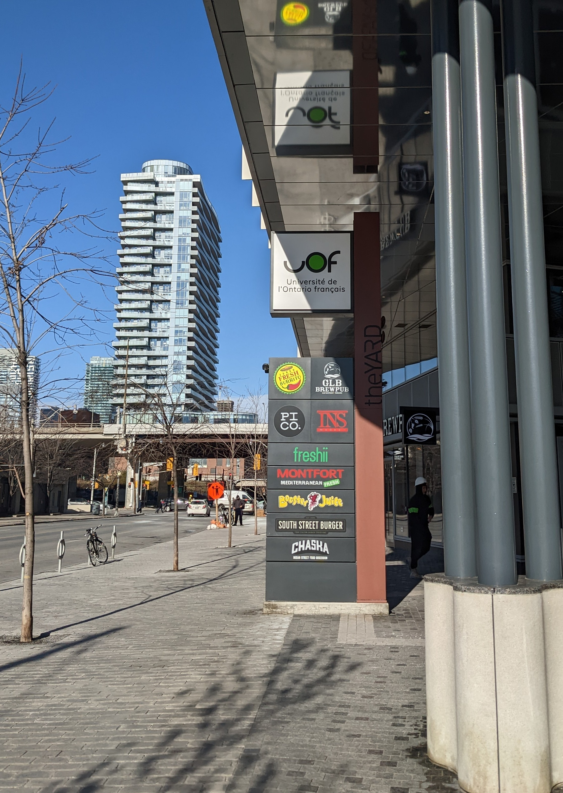

# Visite Guidée Jane's Walk
Un project à propos de la diversité et de l'inclusivité à travers une visite guidée Jane's Walk. [En apprendre d'avantage au sujet de Jane's Walk](https://janeswalk.org/about/). Ce projet fut inspiré par une visite lors de l'événement Doors Open de [La Société d'Histoire de Toronto](https://sht.ca/).

**Reconnaissance du territoire**

L'auteur souhaite &#171;reconnaître le territoire sur lequel est l'actuelle ville de Toronto, le territoire ancestral de plusieurs nations autochtones, dont les Mississaugas of the Credit, les  Anishnabeg, les Chippewa, les Haudenosaunee et le peuple Wendat et héberge plusieurs Premières Nations, les Inuits, et les Métis. L'auteur souhaite souligner le traité 13 signé par les Mississaugas of the Credit, et les Williams Treaties avec les Mississaugas et Chippewa&#187; (Toronto, 2018).

## Contexte

Il y a quatre siècle que les français sont arrivés en amérique du nord, sur le territoire qui deviendra la province de l'Ontario (Sylvestre, 2020). Ils n'ont pas toujours été le bienvenus, comme le démontre leurs luttes pour préserver leur culture et leur langue. Premièrement, le règlement 17 de 1912 à 1917, interdisait l'apprentissage du français dans les écoles. La lutte de l'hôpital Monfort de 1997 à 2002 fut un deuxième combat de résilience pour le français avec le seul hôpital de langue française en Ontario (Arseneault & Bock, 2004; Sylvestre, 2020). Récemment, il y a eu la manifestation de 2018 contre les compressions du gouvernement provincial qui cherchait, en autre, à éliminer les fonds pour la seule université de langue française dans la région de Toronto (Crawley, 2018; Marquis, 2018). À travers ces combats, la culture et la diversité ethnique des francophones en Ontario a changée, incluant divers immigrants de pays francophones.

D'après le dernier recensement canadien datant de 2021, 3.4% (484 425) de la population en Ontario parle le français à la maison, et 11.1% (1 550 545) ont une connaissance du français. À Toronto, 1.4% (38 695) de la population parle le français à la maison et 8.6% (238 505) ont une connaissance du français (Government of Canada, 2022).

*La langue française en Ontario et à Toronto (Government of Canada, 2022)*

D'après des données du recensement canadien datant de 2016, 17% des francophones en Ontario sont nés en dehors du Canada, dont 37% ont immigré de l'afrique, 27% de l'europe, 20% de l'asie et 17% des amériques (Toolkit, 2016). Au niveau municipal, dans la ville de Toronto, 48% des francophones sont nés en dehors du Canada, dont 28% ont immigré de l'afrique, 32% de l'europe, 27% de l'asie et 14% des amériques (Social Development, Finance & Administration, Toronto, 2020).

*La population francophone en Ontario et à Toronto (Toolkit, 2016; Social Development, Finance & Administration, Toronto, 2020)*

 *Lieux de naissance des francophones en Ontario et à Toronto (Toolkit, 2016; Social Development, Finance & Administration, Toronto, 2020)*

En considérant l'inclusivité dans les régions urbaines, nous devons prendre en compte l'histoire, la culture et l'héritage culturel des communautés. Ce sont ces communautés sur lesquels nous nous basons pour rédiger les politiques et sur lesquels nous devons inclure leur savoir faire. Ces communautés doivent faire partie de la composition des régions urbaines, n'étant pas négligées.

## Énonciation d'inspiration
En grandissant comme francophone, il est important de souligner la diversité culturelle et ethnique des francophones en Ontario, et surtout à Toronto, ville multiculturelle. C'est ainsi que notre visite guidée nous amènera à quatre lieux significatif pour les francophones à Toronto.

Trois questions pertinantes au sujet de la visite

***Le lien entre la Nouvelle-France et les autochtones était-il signe de colonisation ou de commerce entre les deux peuple?***

***La population franco-ontarienne fait-elle partie du context historique inclusif de la ville de Toronto?***

***Comment l'UOF cherche-t-elle à promouvoir l'inclusivité dans notre société?***

## Carte avec les lieux significatifs

      

*Carte interactive des lieux et le trajet*

**Itinéraire en transport en commun**

Le trajet en transport en commun se sert des autobus et du métro de la CTT. Nous commençons au **Fort Rouillé** (à côté de la Scadding Cabin sur le terrain du CNE).
1. Du fort, nous marchons à l'arrêt d'autobus pour prendre le 29 Dufferin en direction nord (14470 Saskatchewan Rd at Dufferin St) vers la Station Dufferin.
2. Ensuite, nous prenons la Ligne 2 du métro en direction ouest vers la station Old Mill.
3. Nous marchons au **Parc Étienne Brûlé** (10 Catherine St).
4. Nous marchons vers la station Old Mill, où nous prenons la ligne 2 du métro en direction est vers la station Spadina.
5. Nous marchons au campus de **l'Alliance Française Toronto** (24 Spadina Rd).
6. Nous marchons vers la station Spadina où nous prenons la ligne 1 du métro en direction sud vers la station Union.
7. En sortant de la Gare Union, nous marchons vers la rue Bay pour prendre l'autobus 19 en direction sud (246 Bay St at Front St) vers la rue Lower Jarvis (15320 Queens Quay at Lower Jarvis St).
8. Nous marchons au campus de **l'Université de l’Ontario français** (9 Lower Jarvis St).

## Fort Rouillé

Poste de traite entre les français et les autochtones au bord du lac Ontario, avec une première bâtisse en 1720 au long de la rivière Humber, une seconde en 1750 à l'embouchure de la rivière Humber, et le troisième, le Fort Rouillé, en 1750-1751, avant d'être brulé en 1759. (Marsh, 2015b; Sylvestre, 2019). De la pierre et du ciment sont placés pour tracé l'emplacement du fort, et une plaque y est installée, indiquant la traite de fourrure. Ceci était important au commerce entre la Nouvelle France et les autochtones.(Sylvestre, 2019, 2020). De nos jours, il est essentiel de reconnaître ce moment historique parmit l'histoire de la colonisation.

*Monument du Fort Rouillé*

*Plaque commémorative au Fort Rouillé*

*Plaque avec détails du Fort Rouillé*

## Parc Étienne Brûlé

Ce parc porte le nom de l'exporateur français Étienne Brûlé qui est arrivé en Ontario en 1610. Il a vécu parmit les autochtones, en apprenant leur culture et leur language; moment important entre la relation européenne et amérindienne (Arseneault & Bock, 2004; Marsh, 2015a). C'est Samuel de Champlain qui, lors du combat entre les Iroquois et les Hurons, envoya Brûlé se joindre aux Hurons, descedants vers le sud en utilisant la rivière Humber pour rejoindre le lac Ontario (Marsh, 2015a; Sylvestre, 2019). Quelques rue porte aussi le nom de cet explorateur, dont Brule Crescent, Brule Gardens et Brule Terrace. Le choix qu'a prit la ville en nommant ce parc Étienne Brûlé, est signe de reconnaîssance de la présense des français sur ce territoire autochtone. [Information de la ville de Toronto (en anglais)](https://www.toronto.ca/data/parks/prd/facilities/complex/10/index.html)

*Parc Étienne Brûlé sur les bords de la rivière Humber*

*Pont Old Mill traversant la rivière Humber au bord du parc Étienne Brûlé*

## Alliance Française Toronto

Une organisation charitative et à but non lucratif qui cherche à &#171;incarné les valeurs modernes telles que l’humanisme, le respect de la linguistique et de la diversité culturelle&#187; (Alliance Française, n.d.). Il offre à la communauté des services d'apprentissage en français et de culture et promouvoir le bilingualisme. Leur service de langue s'addresse à un public tout aussi jeune qu'adulte, à côté du théâtre Spadina (Alliance Française, n.d.). C'est par la diversité de la langue que le campus maintien un lien entre les habitants de la métropole et la communauté francophone. Ce ne sont pas que des français d'amérique, mais ceux de plusieurs pays francophone qui cherche à s'intégrer à la communauté Torontoise. [Lien vers le site web](https://www.alliance-francaise.ca/fr/)

*L'entrée de l'Alliance Française sur l'avenue Spadina*

*Le théâtre Spadina de l'Alliance Française*

## Université de l'Ontario français

Le campus a récemment ouvert ses portes suite au combat qui a renversé la décision du gouvernment d'y couper les fonds. La loi de 2017 sur l'Université de l'Ontario français déclare que &#171;la langue française a joué en Ontario un rôle historique et honorable. La constitution d’une université au service de la communauté francophone contribuera à promouvoir une culture francophone forte, dynamique et inclusive qui enrichira encore davantage la vie civique en Ontario&#187; (Ontario, 2014), signe de l'importance d'offrir des programmes poste secondaire en français. L'université offre un programme en immigration, diversité et inclusion qui &#171;se penche sur la diversité des peuples et des personnes au sein de la société, la cohabitation des diverses langues et cultures, la population et les migrations, le leadership des personnes et des organisations dans la société&#187; (Université de l’Ontario français, 2022a, 2022b). D'autres programmes offre aussi des services en terme de demande d'emplois bilingue. [Lien vers le site web de l'université](https://uontario.ca/)

*L'entrée principale de l'Université de l'Ontario français*

*Ensigne de l'Université de l'Ontario français sur Lower Jarvis*

## En sommaire

Revenons à nos trois questions

***Le lien entre la Nouvelle-France et les autochtones était-il signe de colonisation ou de commerce entre les deux peuple?***

Malgré les efforts d'Étienne Brulé de s'intégrer chez les Premières Nations, nous ne pouvons pas négliger ses actions libertines (Sylvestre, 2019). Les colons ont aussi voulu instruire les autochtones avec leurs religions (Arseneault & Bock, 2004). La colonization existaie donc avant l'arrivé des anglais.

***La population franco-ontarienne fait-elle partie du context historique inclusif de la ville de Toronto?***

Les monuments et les noms font parti de l'histoire francophone à Toronto. Leurs actions et leurs batailles sont reconnus et inclus dans l'histoire de la ville Reine. Les franco-ontariens et les francophones peuvent donc s'instruire à partir de ces marqueurs, ainsi que les institutions et services offerts dans la ville. 

***Comment l'UOF cherche-t-elle à promouvoir l'inclusivité dans notre société?***

Le mandat de l'université lui permet d'offrir des programmes en français aux francophones, ce qui est grace aux batailles de cette communautée, les francophones font maintenant parti de l'histoire de la ville de Toronto et de la province de l'Ontario. En obtenant les droits à l'éducation post-secondaire, la communauté francophone peuvent accueillir des immigrants de plusieurs autres pays francophone et non-francophone, n'étant pas nécéssairement des descendants de la Nouvelle-France. C'est ainsi que les francophones et les francophiles peuvent obtenir une éducation supérieure post-secondaire, ainsi qu'utilisés des services tel que ceux offerts par l'Alliance Française. C'est ensemble que la communauté francophone de Toronto peut évoluée et bâtir une société inclusive.

## Mention Spéciale: Centre Francophone du Grand Toronto

L'auteur souhaite souligner ce lieux (555 rue Richmond Ouest) qui offre des services au nouveaux arrivants et au réfugiés, comme étant important pour les francophones et l'inclusion urbaine.

### Références

Les photos ont été prises par l'auteur le 21 novembre 2022

Alliance Française. (n.d.). About us. Alliance Française Toronto. Retrieved November 19, 2022, from https://www.alliance-francaise.ca/en/who/about-us

Arseneault, S., & Bock, M. (Eds.). (2004). L’Ontario français: Des Pays-d’en-Haut à nos jours. Centre franco-ontarien de ressources pédagogiques.

Crawley, M. (2018, December 1). How Ontario’s francophones are teaching Doug Ford a French lesson. CBC. https://www.cbc.ca/news/canada/toronto/doug-ford-ontario-french-protests-1.4927217

Government of Canada, S. C. (2022, February 9). Profile table, Census Profile, 2021 Census of Population—Ontario &#91;Province&#93;;Toronto, City (C) &#91;Census subdivision&#93;, Ontario. https://www12.statcan.gc.ca/census-recensement/2021/dp-pd/prof/index.cfm?Lang=E

Marquis, M. (2018, December 1). Franco-Ontarians protest Ford government’s cuts to services for French speakers - CityNews Toronto. Citynews Toronto. https://toronto.citynews.ca/2018/12/01/ontario-francophone-protests/

Marsh, J. H. (2015a, January 14). Étienne Brûlé - The Canadian Encyclopedia. The Canadian Encyclopedia. https://www.thecanadianencyclopedia.ca/en/article/etienne-brule

Marsh, J. H. (2015b, July 2). Toronto Feature: Fort Rouillé - The Canadian Encyclopedia. The Canadian Encyclopedia. https://thecanadianencyclopedia.ca/en/article/toronto-feature-fort-rouille

Ontario. (2014, July 24). Université de l’Ontario français Act, 2017, S.O. 2017, c. 34, Sched. 43. Ontario.Ca. https://www.ontario.ca/laws/view

Social Development, Finance & Administration, Toronto. (2020). A profile of the Francophone Communities in Toronto. https://www.toronto.ca/legdocs/mmis/2020/fa/bgrd/backgroundfile-145323.pdf

Sylvestre, P.-F. (2019). L’Ontario français, quatre siècles d’histoire (Les Éditions David).

Sylvestre, P.-F. (2020, September 23). Francophones of Ontario (Franco-Ontarians) - The Canadian Encyclopedia. The Canadian Encyclopedia. https://www.thecanadianencyclopedia.ca/en/article/franco-ontarians

Toolkit, W. E. (2016, June 15). Infographic: The French Presence in Ontario. https://www.clo-ocol.gc.ca/en/statistics/infographics/french-presence-ontario

Toronto, C. of. (2018, December 13). Land Acknowledgement (Toronto, Ontario, Canada). City of Toronto; City of Toronto. https://www.toronto.ca/city-government/accessibility-human-rights/indigenous-affairs-office/land-acknowledgement/

Université de l’Ontario français. (2022a, September 6). La rentrée 2022 de l’UOF: Voir plus loin. https://uontario.ca/actualites-etudiants/la-rentree-2022-de-luof-voir-plus-loin

Université de l’Ontario français. (2022b, November 18). A look inside Toronto’s only francophone university. https://www.macleans.ca/longforms/torontos-only-francophone-university-uof/

This page is also available [in English](/janeswalktour)
