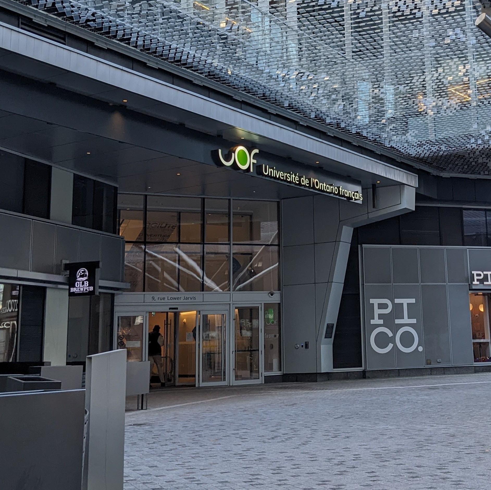

# Jane's Walk Tour
Un project à propos de la diversité et de l'inclusivité à travers un Jane's Walk Tour. [En apprendre d'avantage au sujet de Jane's Walk](https://janeswalk.org/about/)

**Reconnaissance du territoire**

L'auteur souhaite reconnaître le territoire sur lequel est l'actuelle ville de Toronto, le territoire ancestral de plusieurs nations autochtones, dont les Mississaugas of the Credit, les  Anishnabeg, les Chippewa, les Haudenosaunee et le peuple Wendat et héberge plusieurs Premières Nations, les Inuits, et les Métis. L'auteur souhaite souligner le traité 13 signé par les Mississaugas of the Credit, et les Williams Treaties avec les Mississaugas et Chippewa (Toronto, 2018).

## Contexte

Il y a quatres siècle que les français sont arrivés en amérique du nord, sur le territoire qui deviendra la province de l'Ontario (Sylvestre, 2020). Ils n'ont pas toujours été le bienvenus, comme le démontre leurs luttes pour préserver leur culture et leur langue. Premièrement, le règlement 17 de 1912 à 1917, interdisait l'apprentissage du français dans les écoles. La lutte de l'hôpital Monfort de 1997 à 2002 fut un deuxième combat de résilience pour le français avec le seul hôpital de langue française en Ontario (Arseneault & Bock, 2004; Sylvestre, 2020). Récemment, il y a eu la manifestation de 2018 contre les compressions du gouvernement provincial qui cherchait, en autre, à éliminer les fonds pour la seule université de langue française dans la région de Toronto (Crawley, 2018; Marquis, 2018). À travers ces combats, la culture et la diversité ethnique des francophones en Ontario à changer, incluant divers immigrants de pays francophones.

D'après le dernier recensement canadien datant de 2021, 3.4% (484 425) de la population en Ontario parle le français à la maison, et 11.1% (1 550 545) ont une connaissance du français. À Toronto, 1.4% (38 695) de la population parle le français à la maison et 8.6% (238 505) ont une connaissance du français (Government of Canada, 2022).

*La langue francaise en Ontario et à Toronto (Government of Canada, 2022)*

D'après des données du recensement canadien datant de 2016, 17% des francophones en Ontario sont nés en dehors du Canada, dont 37% ont immigré de l'afrique, 27% de l'europe, 20% de l'asie et 17% des amériques (Toolkit, 2016). Au niveau municipal, dans la ville de Toronto, 48% des francophones sont nés en dehors du Canada,  dont 28% ont immigré de l'afrique, 32% de l'europe, 27% de l'asie et 14% des amériques (Social Development, Finance & Administration, Toronto, 2020).

*La population francophone en Ontario et à Toronto (Toolkit, 2016; Social Development, Finance & Administration, Toronto, 2020)*

 *Lieux de naissance des francophones en Ontario et à Toronto (Toolkit, 2016; Social Development, Finance & Administration, Toronto, 2020)*

When building inclusive cities, we must consider the historical cultural heritage of communities. By listening to these communities, policies can be written in a way that considers the variety of knowledge. The communities must fit into the existing city make up.

Having grown up in the francophone community, it is important to realize the current diversity of francophones in Ontario, and certainly Toronto as a multicultural city. As such, this tour will guide us through important landmarks and institutions that reflect the history of Franco-Ontarians.

Therefore, three important questions are at hand

***Were New France’s activities with indigenous people seen as early colonisation or simply as commerce?***

***Is the Franco-Ontario population properly included as part of a historical context in the City of Toronto?***

***How does the UOF contribute to building a more inclusive society?***

## Carte avec les arrêts

      

*Carte interactive des sites et le trajet*

**Itinéraire en transport en commun**

Le trajet en transport en commun se sert des autobus et du métro de la CTT. Nous commençons au **Fort Rouillé** (à côté de la Scadding Cabin sur le terrain du CNE).
1. Du fort, nous marchons à l'arrêt d'autobus pour prendre le 29 Dufferin en direction nord (14470 Saskatchewan Rd at Dufferin St) vers la Station Dufferin.
2. Ensuite, nous prenons la Ligne 2 du métro en direction ouest vers la station Old Mill.
3. Nous marchons au **Parc Étienne Brulé** (10 Catherine St).
4. Nous marchons vers la station Old Mill, où nous prenons la ligne 2 du métro en direction est vers la station Spadina.
5. Nous marchons au campus de **l'Alliance Française Toronto** (24 Spadina Rd).
6. Nous marchons vers la station Spadina où nous prenons la ligne 1 du métro en direction sud vers la station Union.
7. En sortant de la Gare Union, nous marchons vers la rue Bay pour prendre l'autobus 19 en direction sud (246 Bay St at Front St) vers la rue Lower Jarvis (15320 Queens Quay at Lower Jarvis St).
8. Nous marchons vers le campus de **l'Université de l’Ontario français** (9 Lower Jarvis St).

## Fort Rouillé

Trading post between the French and indigenous people existed along the shores of Lake Ontario, the first in 1720 along the Humber River, the second 1750 at the mouth of the Humber River and finally Fort Rouillé in 1750-51 until its ordered destruction in 1759 (Marsh, 2015b; Sylvestre, 2019). Stone is laid on the former boundaries of the fort, with a plaque indicating its function as a fur trading post. This marks an important relationship between indigenous people, as trade was of high importance in New France (Sylvestre, 2019, 2020). With current knowledge of how indigenous people were treated in Canada, the monument provides a reflective moment to consider New France’s initial trading with indigenous people.

*Monument du Fort Rouillé*

*Plaque commémorative au Fort Rouillé*

## Parc Étienne Brulé

This park is named after the French explorer Étienne Brulé who in 1610 arrived in what is now called Ontario. Brulé lived amongst the indigenous people, adopting their language and way of life, a key feature of how the relationship between Europeans and indigenous people occurred in New France (Arseneault & Bock, 2004; Marsh, 2015a). In fact, during Samuel de Champlain’s campaign against the Iroquois with the Hurons, Brulé joined the Hurons making their way south, presumably using the Humber River to reach Lake Ontario (Marsh, 2015a; Sylvestre, 2019). Nearby streets south of Bloor St are also named after him, including Brule Crescent, Brule Gardens and Brule Terrace. The city’s decision to use this name holds a significant contribution to the history of French presence in Ontario, as Brulé was possibly one of the first to see these lands occupied by indigenous people.

*Parc Étienne Brulé sur les bords de la rivière Humber*

## Alliance Française Toronto

This non-profit organization aims to “embody the current value of humanism, respect for linguistics, and cultural diversity” (Alliance Française, n.d.). Their service towards the community includes a French language school offering diverse cultural activities and courses to promote the language and bilingualism. Indeed, they cater to not only school children, but adults with different levels of French language abilities, with their campus located alongside the Spadina Theatre (Alliance Française, n.d.). Their commitment shows how the diversity of learning is important to maintain a strong community within a large metropolis. Franco-Ontarians make up not only decedents of New France, but also people from other French speaking countries.

*L'entrée de l'Alliance Française sur l'avenue Spadina*

*Le théâtre Spadina de l'Alliance Française*

## Université de l'Ontario français

The recently opened campus is a key success of the fights to protect francophone cultural heritage. After the 2018 protest, the government reinstated their commitment to fund the university with the Université de l’Ontario français Act, 2017. As preamble, the Act states that “The French language is an historic and honoured language in Ontario. The establishment of a university with a mission to serve the French-speaking community will help to promote a strong, vibrant, inclusive Francophone culture[…].” (Ontario, 2014), a clear indication of the importance of this community to offer higher education. The university offers a short program on immigration, diversity, and inclusion, “focusing on the diversity of peoples and individuals in society, the cohabitation of diverse languages and cultures, population and migration […] to respond to needs of the labour market” (Université de l’Ontario français, 2022a, 2022b). Other programs aim to respond to the current needs of market seeking bilingual individuals.

*L'entrée principale de l'Université de l'Ontario français*

## En sommaire

By reflecting on the three questions, we can assess and understand the purpose of this tour through a diversity and inclusivity lens.

***Were New France’s activities with indigenous people seen as early colonisation or simply as commerce?***

Although Étienne Brulé’s history shows a will to integrate amongst the indigenous people, we cannot overstate his more controversial actions amongst the people, including tales of debauchery (Sylvestre, 2019). The earlier French colonizers also sought to push their religious views onto the indigenous people (Arseneault & Bock, 2004). As such, colonization was in full swing before the arrival of the English.

***Is the Franco-Ontario population properly included as part of a historical context in the City of Toronto?***

Landmarks and names are an important contributor to the history of French presence in the City of Toronto. Their actions and feats are recognized by way of imprints into the city’s cultural heritage. Franco-Ontarians and francophones alike can look back to the earlier settlement that would become the City of Toronto, where current cultural events and activities continue the presence of francophone in the city.

***How does the UOF contribute to building a more inclusive society?***

The university’s mandate to offer programs in French to the francophone population in the country’s most populous city is a result of years of battles to recognize the present and historical imprints of French in the province and city. From obtaining educational rights to higher levels of education, the community can integrate newcomers amongst the existing population, where francophones in Ontario are not just those descendants of New France. Indeed, immigrants can feel welcomed and attain higher education, while Francophiles can also integrate into the community using programs such as Alliance Française. Together the francophone community of Toronto can evolve past the historical context and utilize services that help build an inclusive society.

### Références

Les photos ont été prises par l'auteur le 21 novembre 2022

Alliance Française. (n.d.). About us. Alliance Française Toronto. Retrieved November 19, 2022, from https://www.alliance-francaise.ca/en/who/about-us

Arseneault, S., & Bock, M. (Eds.). (2004). L’Ontario français: Des Pays-d’en-Haut à nos jours. Centre franco-ontarien de ressources pédagogiques.

Crawley, M. (2018, December 1). How Ontario’s francophones are teaching Doug Ford a French lesson. CBC. https://www.cbc.ca/news/canada/toronto/doug-ford-ontario-french-protests-1.4927217

Government of Canada, S. C. (2022, February 9). Profile table, Census Profile, 2021 Census of Population—Ontario &#91;Province&#93;;Toronto, City (C) &#91;Census subdivision&#93;, Ontario. https://www12.statcan.gc.ca/census-recensement/2021/dp-pd/prof/index.cfm?Lang=E

Marquis, M. (2018, December 1). Franco-Ontarians protest Ford government’s cuts to services for French speakers - CityNews Toronto. Citynews Toronto. https://toronto.citynews.ca/2018/12/01/ontario-francophone-protests/

Marsh, J. H. (2015a, January 14). Étienne Brûlé - The Canadian Encyclopedia. The Canadian Encyclopedia. https://www.thecanadianencyclopedia.ca/en/article/etienne-brule

Marsh, J. H. (2015b, July 2). Toronto Feature: Fort Rouillé - The Canadian Encyclopedia. The Canadian Encyclopedia. https://thecanadianencyclopedia.ca/en/article/toronto-feature-fort-rouille

Ontario. (2014, July 24). Université de l’Ontario français Act, 2017, S.O. 2017, c. 34, Sched. 43. Ontario.Ca. https://www.ontario.ca/laws/view

Social Development, Finance & Administration, Toronto. (2020). A profile of the Francophone Communities in Toronto. https://www.toronto.ca/legdocs/mmis/2020/fa/bgrd/backgroundfile-145323.pdf

Sylvestre, P.-F. (2019). L’Ontario français, quatre siècles d’histoire (Les Éditions David).

Sylvestre, P.-F. (2020, September 23). Francophones of Ontario (Franco-Ontarians) - The Canadian Encyclopedia. The Canadian Encyclopedia. https://www.thecanadianencyclopedia.ca/en/article/franco-ontarians

Toolkit, W. E. (2016, June 15). Infographic: The French Presence in Ontario. https://www.clo-ocol.gc.ca/en/statistics/infographics/french-presence-ontario

Toronto, C. of. (2018, December 13). Land Acknowledgement (Toronto, Ontario, Canada). City of Toronto; City of Toronto. https://www.toronto.ca/city-government/accessibility-human-rights/indigenous-affairs-office/land-acknowledgement/

Université de l’Ontario français. (2022a, September 6). La rentrée 2022 de l’UOF: Voir plus loin. https://uontario.ca/actualites-etudiants/la-rentree-2022-de-luof-voir-plus-loin

Université de l’Ontario français. (2022b, November 18). A look inside Toronto’s only francophone university. https://www.macleans.ca/longforms/torontos-only-francophone-university-uof/

[In English](/janeswalktour)
