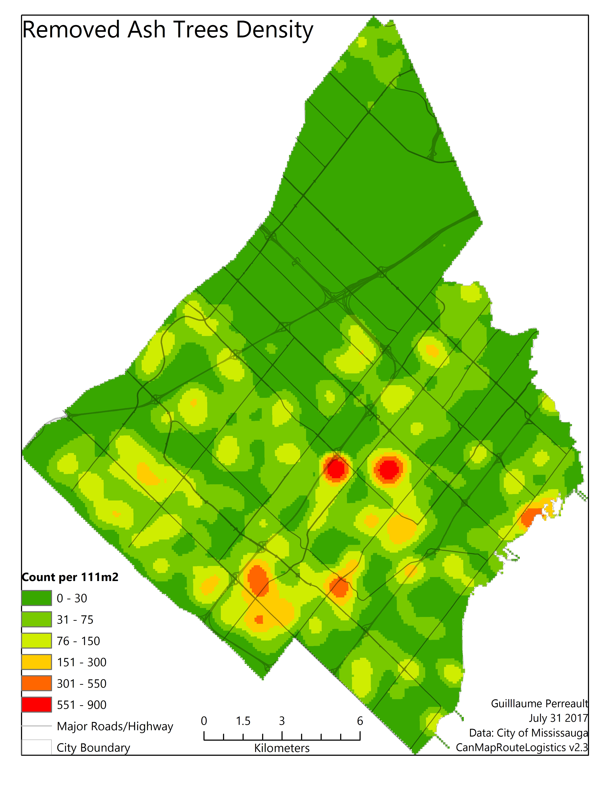
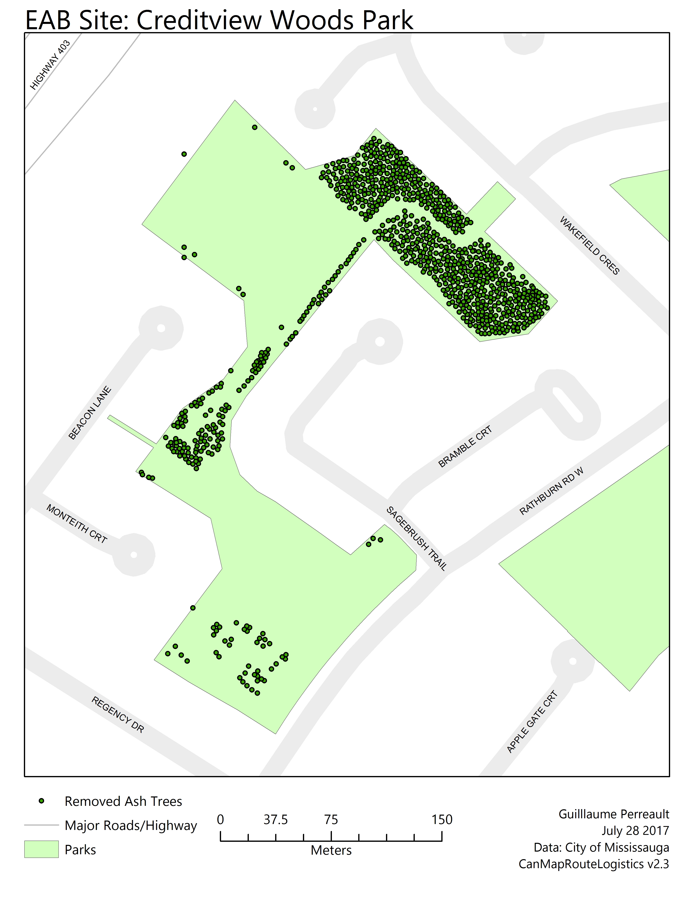

# Emerald Ash Borer in Mississauga
During the summer of 2017 I had the opportunity to particpate in a research project that involved the emerald ash borer infestation in Mississauga. The research was possible thanks to Dr. Yuhong He from the Department of Geography at the University of Toronto Mississauga. Data was provided by the City of Mississauga included removed ash trees from 2014 to 2017, remaining ash trees as of 2017 and treated ash trees from 2016 to 2017. The research I performed looked at the removal of ash trees to locate the highest concentration within the city.

## Removed Tree Density
Map showing the highest areas of ash tree removals. Two areas, located near the centre of the city, had the most removals.

## Highest Density Site: Creditview Woods Park
Map showing the site with the highest density of removed trees. In total, 874 ash trees were removed due to poor health of the trees. As seen on the map, most of the trees were located within the forested area.

## Current Tree Status
During the summer of 2019 I will be visiting Creditview Woods Park to observe the current status of the trees. I had visited the site in 2017 where I noticed the effects of the removal in the forested areas.

The following map shows the current trees located in Creditview Woods Park based on the city's tree data inventory.

      

