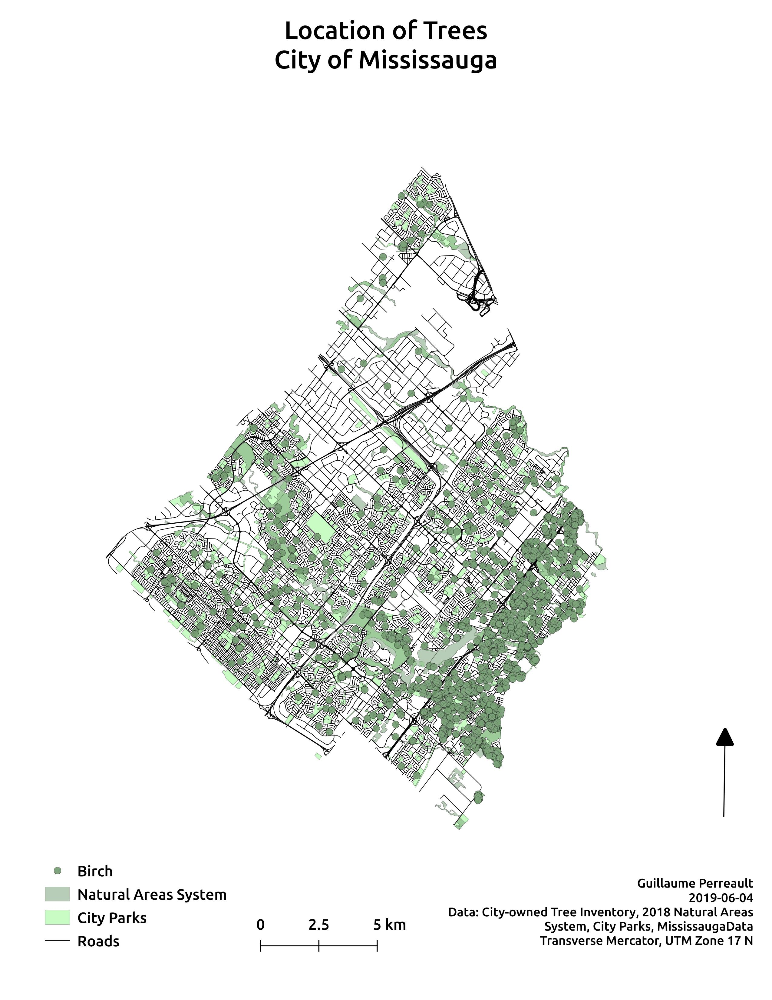
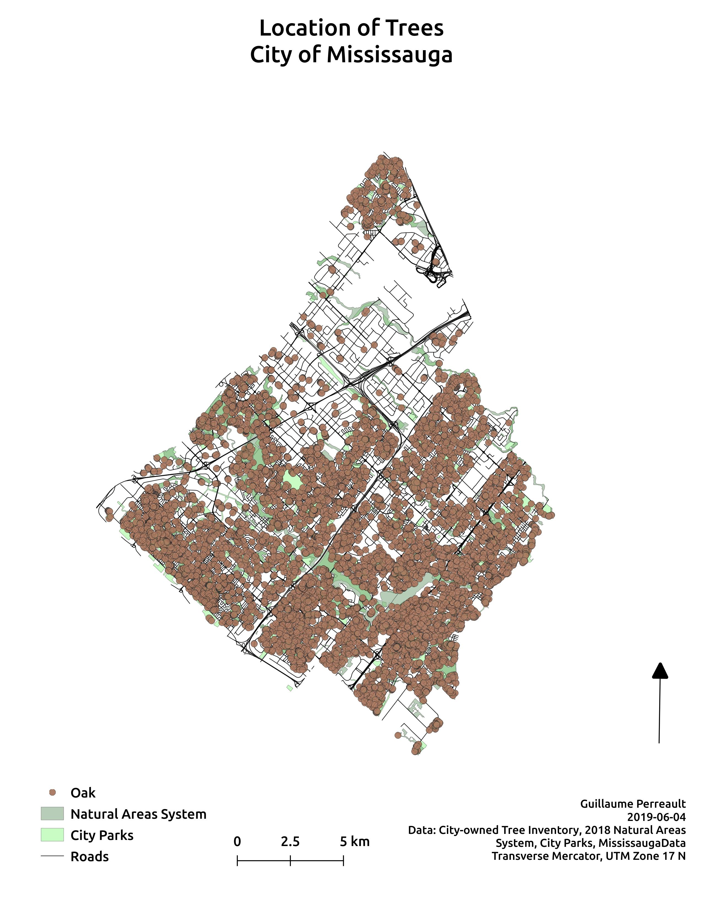
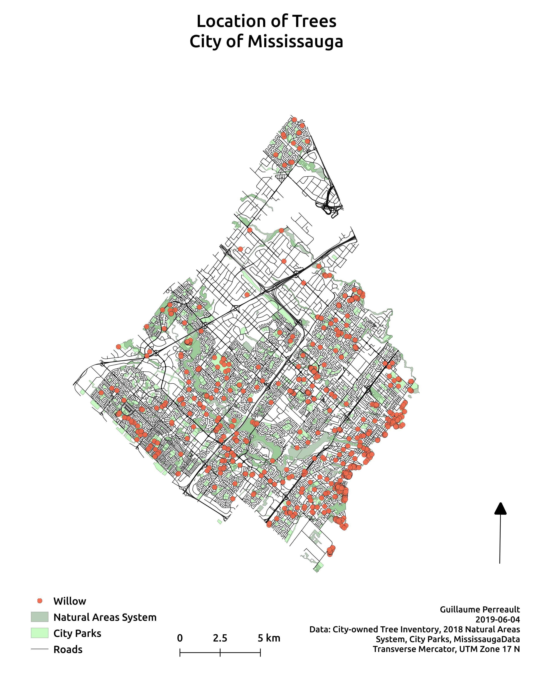

# Trees and pollen allergies in Mississauga
A project to help with my seasonal pollen allergies. It maps the four tree species from which I get the worse allergic reaction during springtime. It uses to city of Mississauga's Open data tree inventory catalog to extract all of the ash, birch, oak and willow species. The goal of the project is to identify where each species is located within the city and compare to start/end of allergy seasons.

## Pollen season
According to the [Aerobiology Research Laboratories](http://www.pollenexperts.ca/toronto-ontario/), all four tree pollens start in April and lasts until late May to early June, the exception being willow that ends earlier in May. Additional research shows that rising temperatures affect pollen season, as shown in [Lewis H Ziska et al's study of the northern hemisphere](https://www.sciencedirect.com/science/article/pii/S2542519619300154?via%3Dihub&for-guid=a3a12ea2-bd65-e711-b65f-90b11c343abd&utm_source=usatoday-Climate%20Point&utm_medium=email&utm_campaign=narrative&utm_term=article_body#!).

[//]: <> ## Static maps
[//]: <> The follow maps show the distribution of each trees species in the city.
[//]: <> 
[//]: <> 
[//]: <> 
[//]: <> 

## Interactive map
The follow map is an interactive map that shows all four tree species in Mississauga.

      

[Homepage](./index.html)
