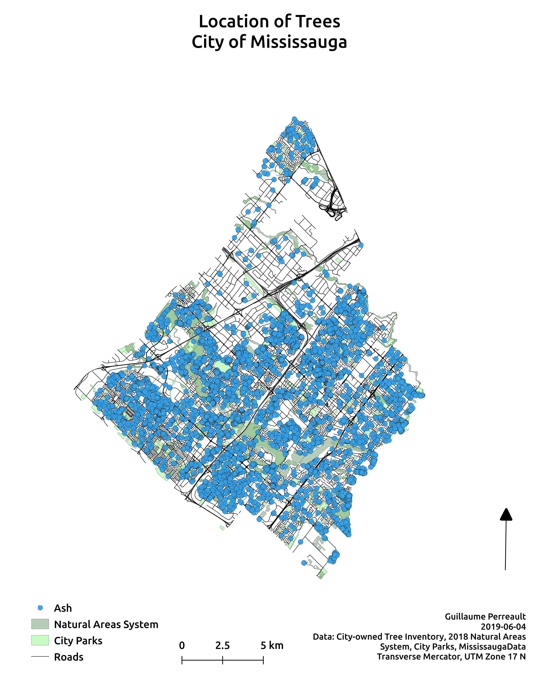

# Trees and pollen allergies in Mississauga
A project to help with my seasonal pollen allergies. It maps the four tree species from which I get the worse allergic reaction during springtime. It uses the City of Mississauga's Open data tree inventory catalog to extract all of the ash, birch, oak and willow species. The goal of the project is to identify where each species is located within the the Lisgar neighbourhood, in particular the trail located alongside a creek.

## Pollen season
According to the [Aerobiology Research Laboratories](http://www.pollenexperts.ca/toronto-ontario/), all four tree pollens start in April and lasts until late May to early June, the exception being willow that ends earlier in May. Through anecdotal evidence I can confirm that pollen season lasts from late April to mid June.

[//]: <> ## Static maps
[//]: <> The follow maps show the distribution of each trees species in the city.
[//]: <> 
[//]: <> 
[//]: <> 
[//]: <> 

## All Trees
The following map shows all four tree species in Mississauga.

      

## Ash map
The following map shows all ash tree species that are located within 100 meters of a city park.

      

## Birch map
The following map shows all birch tree species that are located within 100 meters of a city park.

      

## Oak map
The following map shows all oak tree species that are located within 100 meters of a city park.

      

## Willow map
The following map shows all willow tree species that are located within 100 meters of a city park.

      

<!--
## Lisgar neighbourhood
The Lisgar neighbourhood in Mississauga is home to the Lisgar Meadow Brook Trail, a 4.7km trail that starts at Buttonbush Park, follows a creek and ends at Osprey Marsh. By visualizing the location of the trees along the trail, it becomes useful to know which areas of the trail to possibly avoid during the springtime. A parallel route exists using Lisgar Drive and Rosehurst Drive, where the trees were also mapped to compare both the trail and road.
-->
[//]: <> [Homepage](./index.html)
