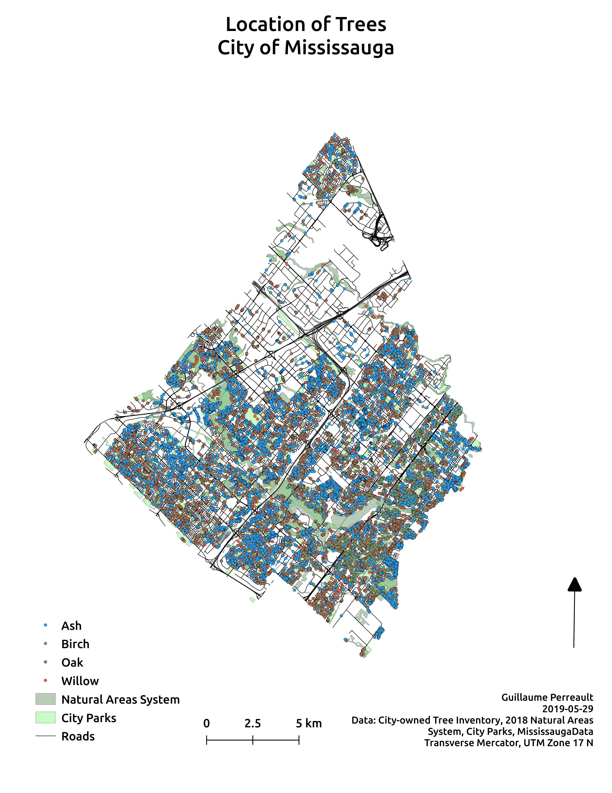

# Trees and pollen allergies in Mississauga
Small project to help with my seasonal pollen allergies. It maps four tree species from which I am allergic to. It uses to city of Mississauga's Open data tree inventory catalog to extract all ash, birch, oak and willow species. The goal of the project is to identify where each species is located within the city and compare to start/end of allergy seasons.

## Static maps
### Large image

## Interactive map

      

[Homepage](./index.html)
